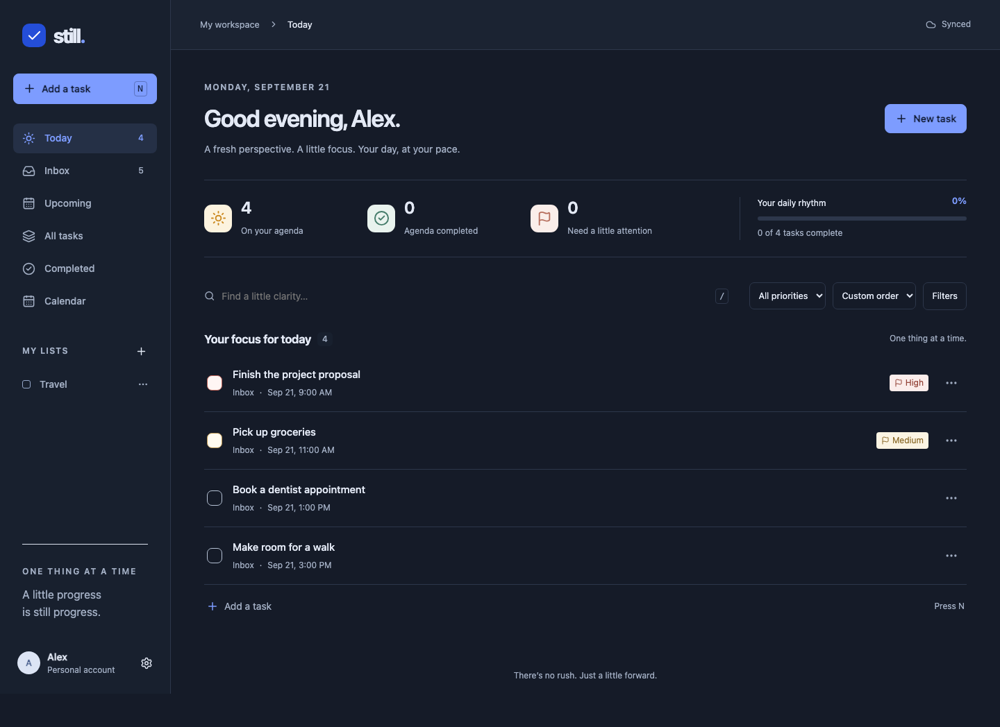
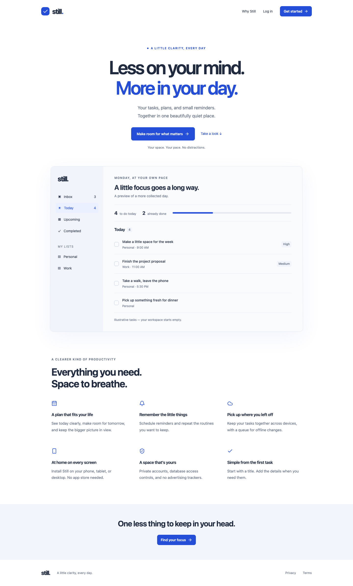

# Still

A calm, installable task and reminder app for phones, tablets, and desktops. Built with Next.js, React, strict TypeScript, Supabase Auth/Postgres, Radix Dialog, Lucide, Luxon, IndexedDB, and Web Push.

**Release status:** implementation and local verification are included. This checkout is not a configured public service. Real-provider email/signup/recovery, Web Push delivery, account deletion, cross-device sync and installed-device offline behavior require the deployment acceptance checks in [docs/RELEASE.md](docs/RELEASE.md). Do not describe this build as production-verified until those checks pass.

## Features

- Email sign-up, verification, login, logout and password recovery through Supabase; no homemade authentication.
- Inbox, Today, Upcoming, Completed, All tasks, custom lists and month/week/day calendars.
- Fast task creation; notes, scheduled/due timestamps, timezone, four priorities, list assignment, duplication and rescheduling.
- Search across task titles, notes and list names; date, status, priority and list filters; manual/date/title/priority ordering.
- Daily, weekday, weekly, monthly, yearly and selected-weekday recurrence; interval controls; one/future/series editing and deletion.
- Server-generated 32-day recurrence horizon; unique occurrence indexes and idempotent completion.
- Multiple reminder offsets plus a custom timestamp, server scheduling, push registration, leases, retries and expired-subscription cleanup.
- Account-scoped IndexedDB snapshots and durable mutations, UUID idempotency, optimistic versions and explicit conflict resolution.
- Supabase Realtime invalidation plus periodic sync; light/dark/system appearance; keyboard shortcuts and accessible dialogs.
- PWA manifest, PNG/maskable/Apple icons, offline shell and static caching, generic lock-screen notification content.
- No advertising or analytics; account deletion cascades; editable privacy and terms pages.

Optional social login, subtasks, tags, drag-and-drop, natural-language parsing, attachments and shared lists are not implemented. Ordering has explicit keyboard/touch controls. Calendar rescheduling uses the task editor.

## Screenshots

The workspace capture below uses isolated, clearly identified component-test data. It demonstrates the real React layout; it is not evidence of a connected Supabase account or working push delivery.





## Requirements

- Node.js **24 LTS** and npm 11+ (see `.nvmrc`).
- A Supabase project, or Docker + the Supabase CLI for a local stack.
- HTTPS for an Internet deployment and Web Push; localhost is supported for development.
- A Vercel plan supporting minute cron jobs, or a separate scheduler that can securely call the cron endpoint every minute.

## Local setup

```sh
npm ci
cp .env.example .env.local
```

Set the environment values below. Then:

```sh
npm run dev
```

Open http://localhost:3000. Without Supabase public configuration, the sign-in screen explains setup rather than simulating authentication.

For a local Supabase stack:

```sh
npx supabase start
npx supabase db reset
npx supabase status
```

Docker must be running. Copy the local API URL/public key/service-role key from `supabase status` into `.env.local`. Never commit them. Local confirmation and recovery emails are available in the Supabase local mail UI on port 54324. Development configuration is in `supabase/config.toml`; hosted-project Auth settings must be configured separately.

Use one consistent browser origin (`localhost` or `127.0.0.1`) for login and callback flows. PKCE verification/recovery links should be opened in the browser that initiated them.

## Environment variables

| Variable                               | Visibility  | Purpose                                                            |
| -------------------------------------- | ----------- | ------------------------------------------------------------------ |
| `NEXT_PUBLIC_SUPABASE_URL`             | Public      | Project API origin                                                 |
| `NEXT_PUBLIC_SUPABASE_PUBLISHABLE_KEY` | Public      | Publishable/legacy anon key; RLS protects data                     |
| `NEXT_PUBLIC_APP_URL`                  | Public      | Canonical absolute app origin for metadata                         |
| `NEXT_PUBLIC_VAPID_PUBLIC_KEY`         | Public      | VAPID public key for browser subscription                          |
| `SUPABASE_SERVICE_ROLE_KEY`            | Server only | Rate limiting, delivery, subscription management, account deletion |
| `VAPID_PRIVATE_KEY`                    | Server only | VAPID signing key                                                  |
| `VAPID_SUBJECT`                        | Server only | Contact URI, usually `mailto:operator@example.com`                 |
| `CRON_SECRET`                          | Server only | Random secret of at least 32 bytes for the scheduler               |

Generate VAPID keys with `npx web-push generate-vapid-keys`. Generate the cron secret using your password manager or `openssl rand -hex 32`. Store secrets only in ignored environment files and your hosting provider's encrypted settings. Public environment values are embedded at **build time**; rebuild after changing them. Keep VAPID keys stable or users must resubscribe.

## Database and authentication

Apply the complete migration:

```sh
npx supabase login
npx supabase link --project-ref YOUR_PROJECT_REF
npx supabase db push
```

The migration creates tables, owner constraints, indexes, triggers, RLS policies, mutation functions and scheduler functions. See [architecture](docs/ARCHITECTURE.md) and [schema](docs/SCHEMA.md). Never recreate tables by manually clicking in the dashboard. The project includes its migration from an empty schema; run tests before modifying it. For an already deployed database, create a new forward migration.

In Supabase Auth:

1. Enable email/password, require email confirmation, and set minimum password length to 12.
2. Set Site URL to your canonical HTTPS domain.
3. Allow exactly `https://YOUR_DOMAIN/auth/callback` and `https://YOUR_DOMAIN/auth/callback?next=reset`. Add localhost callbacks only to a development project.
4. Configure a verified SMTP sender, provider quotas and Auth email/sign-in rate limits. Supabase's default email service is not sufficient for a public launch.
5. Use a disposable account to verify signup, verification, login, reset and logout before launch.

Client access uses bearer tokens verified by `getUser` on every protected API request. Mutations execute under the user's JWT and a database function with explicit ownership/version checks. Read policies independently enforce ownership. Direct writes to user tables are revoked, even for authenticated clients. Service-role credentials never enter client modules.

## Notifications and recurrence

`GET /api/reminders` requires `Authorization: Bearer CRON_SECRET`. Vercel injects this header for configured cron jobs. To use another scheduler, call the endpoint with that header every minute; never put the secret in a query string.

The job expands recurring series, claims up to 20 due reminders with a five-minute lease, sends generic Web Push messages, retires 404/410 subscriptions, and retries transient failures up to five attempts. Stale exhausted leases become failed. Reminders older than one hour when scheduled are marked missed; they do not create a storm of historical notifications. Delivery is at least once: deterministic notification tags collapse duplicate presentations, but delivery is not guaranteed.

Recurring dates are anchored in the series timezone. January 31 resumes on March 31 after February's clamp. A single occurrence reschedule leaves the series anchor alone. The job expands up to 100 series per tick and up to 64 successors per selected series, ordered by last expansion. Large backlogs need multiple ticks. Recurrence expansion runs independently when push keys are absent. In that state the job reports `pushConfigured: false`, leaves reminder delivery unclaimed, and does not mark the push scheduler healthy.

Offset reminders repeat; custom absolute reminder timestamps apply to the edited occurrence. “Custom” recurrence means selected weekdays each week; the other frequency options support intervals. The calendar displays materialized occurrences, not an infinite expansion.

Users explicitly enable notifications in Settings. The app separately reports browser permission, registered devices, and whether the scheduler checked in within three minutes. Permission or subscription alone never means the scheduler is active. iPhone/iPad require a Home Screen installation and supported OS/browser. OS power/network restrictions may delay notifications.

## Offline and synchronization

After an authenticated online visit installs the service worker, the public workspace shell and its static assets are cached. Private API responses are **never** cached by the service worker. IndexedDB holds a per-account snapshot and queue. Local optimistic changes update immediately; a change is removed from the queue only after server acknowledgement. The acknowledged projection is retained even if the following fetch fails.

Multiple tabs serialize sync with Web Locks when supported and share invalidations using BroadcastChannel. Server mutation UUIDs prevent duplicates when requests are retried. A stale version becomes a visible conflict. “Apply my version” explicitly rebases the full item; “Use server version” discards pending changes for that item. Deleted server records cannot be resurrected. Copy their displayed pending data into a new task if needed.

A valid cached session is needed to open the workspace offline. An expired session may require reconnecting. Browser storage eviction or manually clearing site data can remove unsynchronized data. Sign-out requires resolving pending changes, removes the current device subscription, and clears the local snapshot. The current sync implementation supports fewer than 10,000 live tasks and 1,000 live lists per account and returns an explicit error rather than silently truncating at the limit. A database user-row snapshot is fetched in 1,000-row pages; realtime updates between pages reconcile on the next sync.

## Tests and production build

```sh
npm run typecheck
npm run lint
npm test
npm run build
npx playwright install chromium
npm start
# In another terminal:
npm run test:e2e
```

Unit tests cover validation, DST boundaries, recurrence, reminders and offline projection. PostgreSQL integration tests use **PGlite's real PostgreSQL engine**, execute the actual migration, install minimal test Auth roles, and assert RLS and cross-user mutation denial. This verifies database logic, not the hosted Supabase Auth service.

Playwright runs public navigation, responsive-width, header, authorization and axe accessibility checks for desktop, iPhone and iPad viewports. The real authenticated journey is intentionally skipped unless `E2E_EMAIL` and `E2E_PASSWORD` are set to a verified disposable account in the configured project. `E2E_BASE_URL` overrides the local origin. Tests never substitute fake authentication in the production app.

See [release verification](docs/RELEASE.md) for checks that cannot be replaced by local unit tests.

## Deploy to Vercel

1. Push this source to a repository you control. Confirm `.env.local` is ignored.
2. Create a Supabase production project; apply the migration and configure Auth/SMTP above.
3. Import the repository in Vercel as a **Next.js** project. Select **Node.js 24.x**.
4. Add all variables from `.env.example` to the production environment; use separate projects/keys for previews.
5. Set `NEXT_PUBLIC_APP_URL` to the production HTTPS origin. Deploy with `npm run build`.
6. Confirm the minute job in `vercel.json` is supported by your plan, or configure an external authenticated scheduler. Check scheduler status and logs, then receive an actual notification with the app closed.
7. Add a custom domain in Vercel, apply the DNS records it provides, wait for HTTPS, and update Supabase's exact callback URLs and app URL. Rebuild.
8. Replace legal placeholders and complete every release check before opening signup publicly.

No automatic public deployment was performed from this checkout. Provider account configuration and live verification are required.

## Security and contributing

Read [SECURITY.md](SECURITY.md), [CONTRIBUTING.md](CONTRIBUTING.md) and [docs/RELEASE.md](docs/RELEASE.md). Keep logs free of bearer tokens, push keys and task text. Back up the database, test restoration, monitor cron failures and queue delay, and keep dependencies patched. RLS tests should remain mandatory in CI.

Licensed under [MIT](LICENSE).

### Optional development seed

Create and verify a disposable account first. Load `.env.local` and set `ALLOW_DEV_SEED=true`, `SEED_EMAIL` and `SEED_PASSWORD` in your local shell, then run:

```sh
node --env-file=.env.local scripts/seed.mjs
```

This inserts five development tasks through the real mutation RPC. The script refuses `NODE_ENV=production` and never runs during builds or migrations. Do not use a production account.
